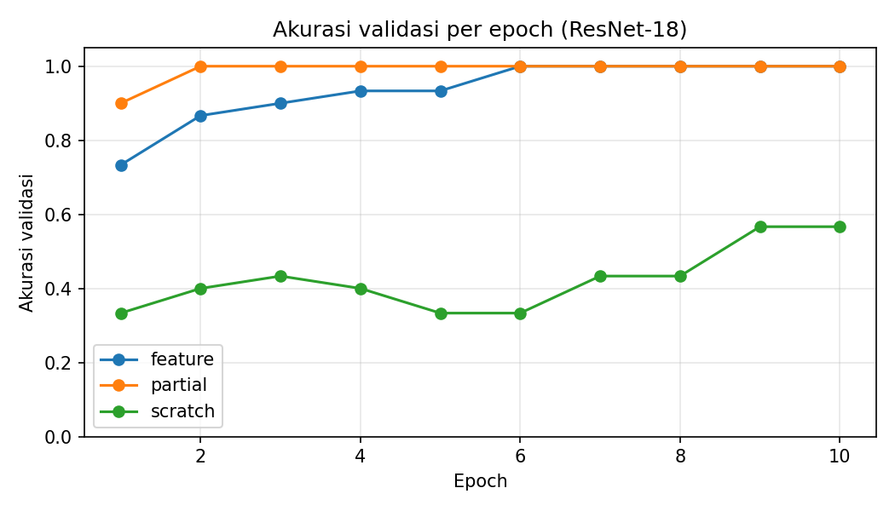

# Transfer Learning ResNet-18: Klasifikasi Tutup Botol Hijau, Tutup Botol Coklat, dan Earphone

**Nama:** Dzaki Taufiqurrahman  
**Mata kuliah:** RET503 Computer Vision and Deep Learning, Pertemuan 3

## 1. Tujuan
Tugas ini membangun model klasifikasi gambar dengan metode transfer learning. Model ResNet-18 yang sudah dilatih di ImageNet dipakai ulang untuk mengenali tiga benda kecil dari foto kamera sendiri. Tiga pendekatan dibandingkan: feature extraction, fine-tuning parsial, dan pelatihan dari nol (scratch).

## 2. Dataset
- **Sumber:** foto sendiri, diambil dengan kamera HP.
- **Kelas (3):** `earphone`, `tutup_coklat`, `tutup_hijau`
- **Jumlah citra:** earphone 53, tutup_coklat 54, tutup_hijau 51 (total 158).
- **Variasi data:** tiap kelas diambil di dua latar (sekitar separuh di lantai abu-abu dan separuh di meja triplek), dengan variasi posisi benda, jarak, dan pencahayaan. Sebagian foto terkena bayangan HP atau tangan.
- **Catatan:** semua foto memiliki border/watermark kamera yang sama, dan foto dikirim lewat WhatsApp sehingga terkompresi.
- **Pembagian:** 80% train (128 foto) dan 20% validasi (30 foto), diacak per kelas dengan seed 42.

## 3. Metode
Model: ResNet-18 pretrained ImageNet. Head (`fc`) diganti sesuai jumlah kelas (3).

| Mode | Bobot awal | Yang dilatih | Learning rate |
|---|---|---|---|
| feature | ImageNet | fc saja | 1e-3 |
| partial | ImageNet | layer4 + fc | 1e-4 / 1e-3 |
| scratch | acak | semua layer | 1e-3 |

Pengaturan lain: input 224x224, normalisasi mean/std ImageNet, optimizer Adam, 10 epoch, batch 16, scheduler CosineAnnealingLR. Augmentasi data latih: RandomResizedCrop, HorizontalFlip, ColorJitter. Pada mode feature dan partial, layer yang dibekukan dijaga tetap dalam mode `eval()` agar statistik BatchNorm tidak berubah. Pelatihan dijalankan di Google Colab dengan CPU.

## 4. Hasil

| Mode | Akurasi val terbaik | Waktu latih (s) | Epoch akurasi >= 90% |
|---|---|---|---|
| feature | 100.0% | 224 | 3 |
| partial | 100.0% | 274 | 1 |
| scratch | 56.7% | 454 | - |

Grafik akurasi validasi per epoch:



## 5. Analisis
Dua mode transfer learning jauh lebih baik daripada scratch. Feature extraction mencapai akurasi validasi 100% pada epoch 6 dan sudah di atas 90% sejak epoch 3. Fine-tuning parsial lebih cepat lagi, yaitu di atas 90% sejak epoch 1 dan 100% sejak epoch 2. Sebaliknya, scratch hanya mencapai 56,7%, grafiknya naik turun, dan tidak pernah mencapai 90% dalam 10 epoch.

Alasannya, ResNet-18 pretrained sudah mengenali fitur umum seperti tepi, warna, dan tekstur dari jutaan gambar ImageNet. Untuk tugas ini model hanya perlu menyesuaikan lapisan akhir (atau layer4) ke tiga benda baru. Model scratch harus mempelajari semuanya dari nol, padahal data latihnya hanya 128 foto, sehingga tidak cukup.

Fine-tuning parsial lebih cepat mencapai 90% karena layer4 ikut menyesuaikan diri, tetapi waktu latihnya sedikit lebih lama (274 detik dibanding 224 detik) karena lebih banyak parameter yang dilatih. Mode scratch paling lama (454 detik) karena semua layer dilatih, dan hasilnya paling buruk.

**Keterbatasan.** Akurasi 100% perlu dibaca hati-hati. Data validasi hanya 30 foto, dan foto diambil beruntun dengan posisi HP yang mirip. Karena pembagian train dan validasi dilakukan acak, foto yang hampir kembar bisa masuk ke kedua set (data leakage), sehingga akurasi bisa lebih tinggi daripada performa di kondisi nyata. Benda juga kecil di dalam frame, jadi model kemungkinan banyak mengandalkan warna benda. Untuk perbaikan, data bisa ditambah dengan latar dan pencahayaan lebih beragam, pembagian data dilakukan berdasarkan sesi atau latar, dan model diuji pada foto baru yang tidak ikut proses pelatihan.

**Kesimpulan.** Pada data yang sedikit, transfer learning jauh lebih efektif daripada melatih dari nol. Feature extraction sudah cukup baik untuk kasus ini, dan fine-tuning parsial belajar sedikit lebih cepat.

## 6. Cara menjalankan
```bash
pip install torch torchvision matplotlib
python train.py
```
Struktur data yang dibutuhkan: `dataset_raw/<nama_kelas>/*.jpg`

## 7. Isi repositori
- `train.py`: skrip pelatihan 3 mode
- `dataset_raw/`: dataset foto (3 kelas)
- `results.csv`, `results.json`: hasil pelatihan
- `accuracy_per_epoch.png`: grafik akurasi validasi per epoch
